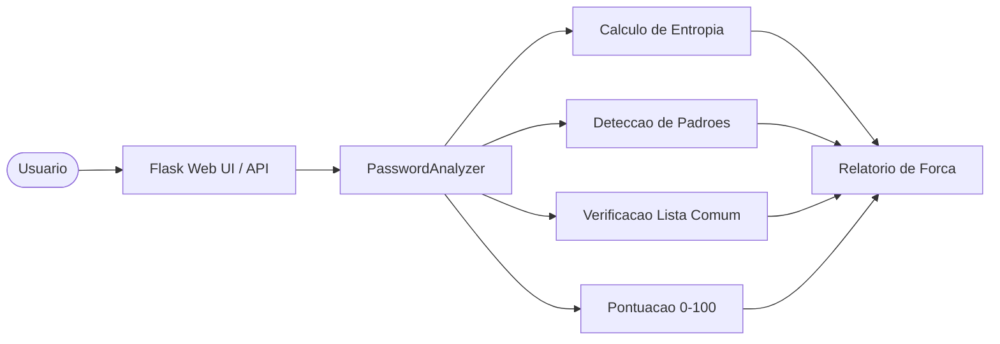
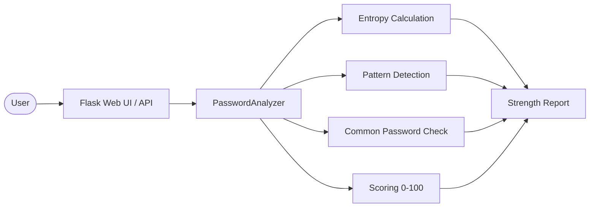

# Password Strength Analyzer

[](https://www.python.org/)
[](https://flask.palletsprojects.com/)
[](LICENSE)

[Portugues (BR)](#portugues-br) | [English](#english)

---

## Portugues (BR)

### Visao Geral

Aplicacao web em Python/Flask para analise de forca de senhas. O projeto consiste em um unico arquivo (`password_analyzer.py`, ~770 linhas incluindo o template HTML embutido) que oferece analise em tempo real via interface web e API REST.

### Funcionalidades

- **Calculo de entropia** -- entropia de Shannon baseada no tamanho do charset
- **Deteccao de padroes** -- caracteres sequenciais, caracteres repetidos, padroes de teclado, datas
- **Verificacao contra lista local** -- comparacao com uma lista embutida de senhas comuns (nao usa a API Have I Been Pwned)
- **Pontuacao de forca** -- escala de 0 a 100 com nivel descritivo (Muito Fraca a Muito Forte)
- **Geracao de senhas** -- gerador com conjuntos de caracteres configuraveis usando `crypto.getRandomValues()` (client-side) e `secrets` (server-side)
- **Interface web** -- UI Flask com analise em tempo real e feedback visual
- **API REST** -- `POST /analyze` e `GET /generate`

### Arquitetura



> **Nota:** A verificacao de senhas vazadas via HIBP (Have I Been Pwned) **nao esta implementada**. A verificacao e feita apenas contra uma lista local de senhas comuns embutida no codigo.

### Inicio Rapido

```bash
# Clonar o repositorio
git clone https://github.com/galafis/Password-Strength-Analyzer.git
cd Password-Strength-Analyzer

# Criar ambiente virtual (recomendado)
python -m venv venv
source venv/bin/activate  # Windows: venv\Scripts\activate

# Instalar dependencias
pip install -r requirements.txt

# Executar a aplicacao
python password_analyzer.py
```

Abra `http://localhost:5000` no navegador.

### Endpoints da API

| Metodo | Rota | Descricao |
|--------|------|-----------|
| `GET` | `/` | Interface web |
| `POST` | `/analyze` | Analisa uma senha (JSON: `{"password": "..."}`) |
| `GET` | `/generate` | Gera uma senha segura (query param: `?length=16`) |

### Testes

```bash
pytest tests/ -v
```

### Estrutura do Projeto

```
Password-Strength-Analyzer/
├── password_analyzer.py   # Aplicacao principal (Flask + HTML embutido)
├── requirements.txt       # Dependencias (flask, pytest)
├── tests/
│   ├── __init__.py
│   └── test_main.py       # Testes unitarios e de integracao
├── LICENSE
└── README.md
```

### Stack Tecnologica

| Tecnologia | Papel |
|------------|-------|
| Python | Linguagem principal |
| Flask | Framework web |
| pytest | Testes |

---

## English

### Overview

A Python/Flask web application for password strength analysis. The project consists of a single file (`password_analyzer.py`, ~770 lines including the embedded HTML template) that provides real-time analysis via a web interface and REST API.

### Features

- **Entropy calculation** -- Shannon entropy based on charset size
- **Pattern detection** -- sequential characters, repeated characters, keyboard patterns, dates
- **Local common password check** -- comparison against a built-in list of common passwords (does not use the Have I Been Pwned API)
- **Strength scoring** -- 0-100 scale with descriptive level (Very Weak to Very Strong)
- **Password generation** -- generator with configurable character sets using `crypto.getRandomValues()` (client-side) and `secrets` (server-side)
- **Web interface** -- Flask UI with real-time analysis and visual feedback
- **REST API** -- `POST /analyze` and `GET /generate`

### Architecture



> **Note:** HIBP (Have I Been Pwned) breach checking is **not implemented**. The check is performed only against a local list of common passwords embedded in the source code.

### Quick Start

```bash
# Clone the repository
git clone https://github.com/galafis/Password-Strength-Analyzer.git
cd Password-Strength-Analyzer

# Create virtual environment (recommended)
python -m venv venv
source venv/bin/activate  # Windows: venv\Scripts\activate

# Install dependencies
pip install -r requirements.txt

# Run the application
python password_analyzer.py
```

Open `http://localhost:5000` in your browser.

### API Endpoints

| Method | Route | Description |
|--------|-------|-------------|
| `GET` | `/` | Web interface |
| `POST` | `/analyze` | Analyze a password (JSON: `{"password": "..."}`) |
| `GET` | `/generate` | Generate a secure password (query param: `?length=16`) |

### Tests

```bash
pytest tests/ -v
```

### Project Structure

```
Password-Strength-Analyzer/
├── password_analyzer.py   # Main application (Flask + embedded HTML)
├── requirements.txt       # Dependencies (flask, pytest)
├── tests/
│   ├── __init__.py
│   └── test_main.py       # Unit and integration tests
├── LICENSE
└── README.md
```

### Tech Stack

| Technology | Role |
|------------|------|
| Python | Core language |
| Flask | Web framework |
| pytest | Testing |

---

### Author

**Gabriel Demetrios Lafis**
- GitHub: [@galafis](https://github.com/galafis)
- LinkedIn: [Gabriel Demetrios Lafis](https://linkedin.com/in/gabriel-demetrios-lafis)

### License

This project is licensed under the MIT License -- see the [LICENSE](LICENSE) file for details.
